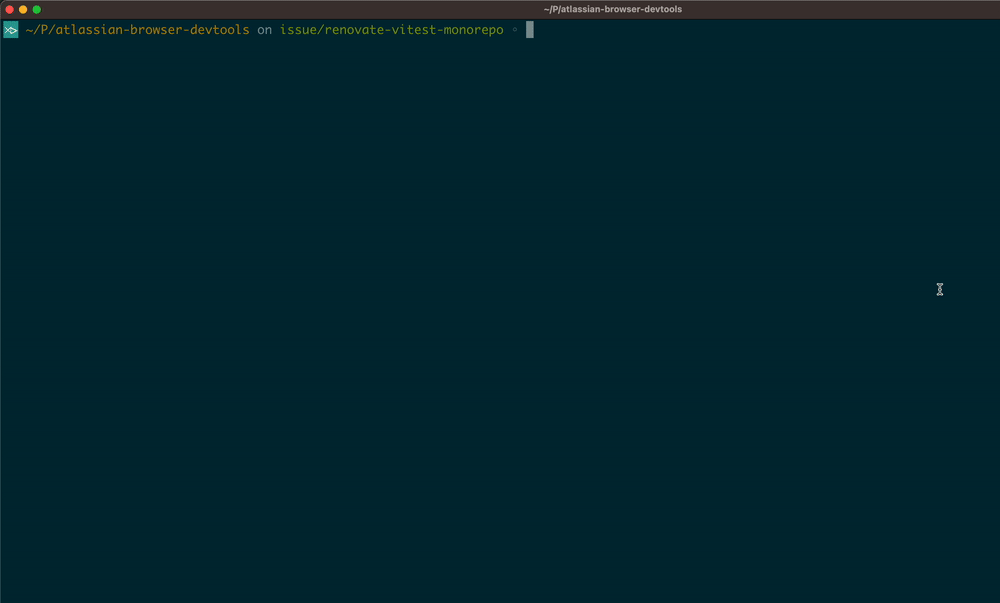
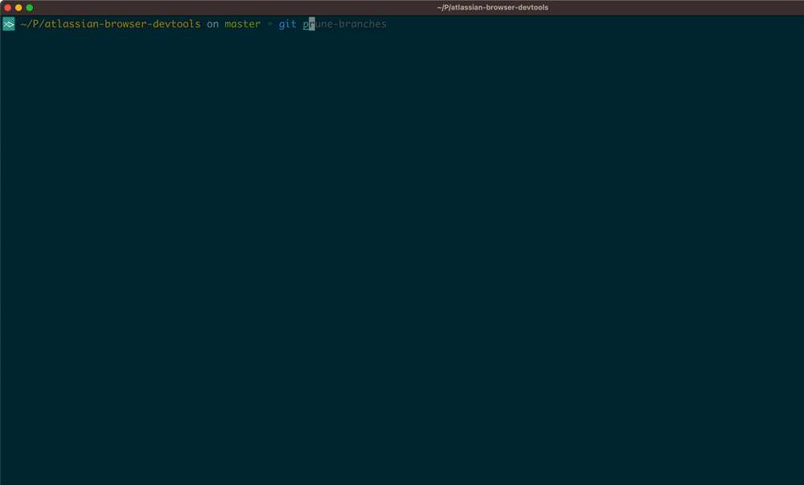
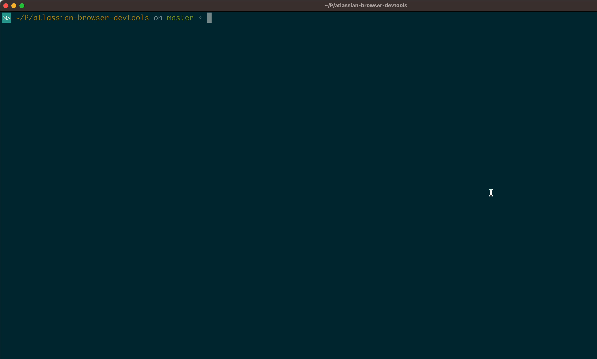

# GIT helpers

`git switch-branch` & `git prune-branches` & `git builds`

A few extra commands that will improve your developer productivity.

## Installation

```
npm install -g git-switch-branch

git config --global alias.switch-branch '!git-switch-branch'
git config --global alias.prune-branches '!git-prune-branches'
git config --global alias.builds '!git-builds'
```

### Credentials

> This step is optional and required only if you plan to use the `git builds` command.

Before you use the `git builds` command, you need to create a config file that includes access tokens to Bitbucket Cloud and/or Data Center:

1. Create a config file under your user directory:

```sh
touch ~/.atl-config
```

2. Edit the file with your editor of choice and provide access tokens:

    ```sh
    code ~/.atl-config
    ```

    Example content:

    ```env
    # If the projects you are working on are not hosted on Bitbucket Cloud, skip this part
    # 1. Create a new app password with the READ permissions to the repository and pipelines https://bitbucket.org/account/settings/app-passwords/
    BITBUCKET_CLOUD_TOKEN=<<APP-PASSWORD>>
    # 2. Bitbucket username that can be found on https://bitbucket.org/account/settings/
    BITBUCKET_CLOUD_USERNAME=maciej-adamczak

    # If the projects you are working on are not hosted on Bitbucket DC, skip this part
    # 3. Base URL to Bitbucket DC instance
    BITBUCKET_DC_URL=https://my-bitbucket.instance.com
    # 4. HTTP Access Token with the READ permissions.
    # You can generate the token from your account profile: Manage account -> HTTP access token -> Create token
    BITBUCKET_DC_TOKEN=<<HTTP-ACCESS-TOKEN>>
    ```

> Why do you need to generate and save access tokens?

The password and access tokens are only required if you want to use the `git build` alias.

## Usage

### Switch branch

Interactively switch local GIT branch with a better DX:

```
git switch-branch
```



### Prune local branches

Interactively prune unused local GIT branches:

```
git prune-branches
```



### Builds

Shows build status for your local GIT branch:

```
git builds
```


